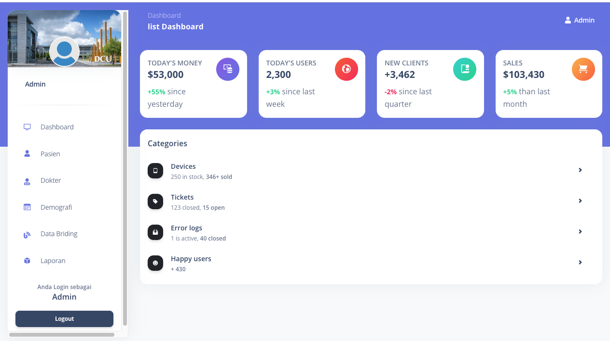

# Sistem
project Sistem LIS

## Sistem LIS


### Installation
1. Clone the repository using the command "git clone [link]"
2. Create database in MySql
3. Configure the .env file accordingly
4. Run command 

```
$composer install
$php artisan migrate
$php artisan db:seed
$php artisan serve
$php artisan storage:link
```
### Mendapat Update kodingan terbaru
```
$ git fetch origin master
$ git pull origin master
```

## Progres 19/8/2023
* setting admin (done)
* integrasi database LIS 


* demo

